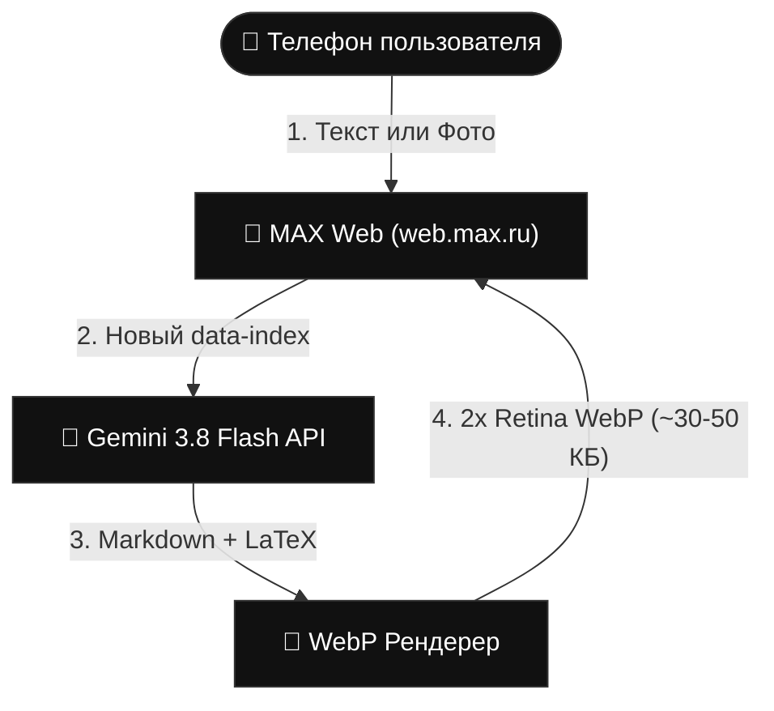

# 🚀 MAX Gemini WebP Assistant

[](https://www.python.org/downloads/)
[](https://aistudio.google.com/)
[](https://playwright.dev/)
[](#)
[](LICENSE)

Автономный ИИ-ассистент на базе **Gemini 3.8 Flash** для мессенджера **MAX** (`web.max.ru`). Создан для мгновенного доступа к передовому искусственному интеллекту в условиях мобильных **«белых списков»** (без VPN и без необходимости оформления ИП/ООО/самозанятости).

Ответы компилируются в ультралегкие графические карточки WebP со строгим минималистичным стилем, поддержкой сложной математики (LaTeX), форматирования Markdown и подсветки синтаксиса кода.

---

## ✨ Возможности

- 📱 **Доступ через «Избранное»**: пишите любые вопросы и задачи прямо с мобильного телефона в свои сохраненные сообщения.
- 📸 **Распознавание фото и решение задач по снимку**: отправляйте фотографии задач из учебников, графиков, схем, рукописных конспектов или скриншотов кода с текстовым вопросом («Реши номер 4», «Найди ошибку в коде») или даже без текста — Gemini 3.8 Flash детально разберет снимок.
- 📐 **Идеальный LaTeX и формулы**: дроби, интегралы, матрицы, корни ($\sqrt{x^2 + y^2}$), греческие буквы рендерятся через KaTeX 1-в-1 как в научной литературе.
- 🎨 **Минималистичный дизайн**: глубокий черный фон (`#000000`), четкий белый шрифт, строгие прямоугольные углы (`border-radius: 0`), без лишних надписей и бейджей.
- ⚡ **Легковесный WebP (20–40 КБ)**: мгновенная отправка в чат, минимальный расход трафика, читаемость на экранах любого разрешения (2x Retina рендеринг).
- 🔄 **Умная индексация (`data-index`)**: сообщения отслеживаются по уникальным порядковым номерам в чате. Можно задавать один и тот же вопрос сколько угодно раз подряд — бот не посчитает его дубликатом и не заблокирует.
- 🛡️ **Защита от мусора и зацикливаний**: бот фильтрует служебные плашки мессенджера, прогресс-бары загрузки («100%», «8.44 КБ / 11.13 КБ»), таймстемпы и даты.
- 🚀 **Запуск в 1 клик**: готовые скрипты `lin_start.sh` (Linux) и `win_start.bat` (Windows) с автоматическим развертыванием `.venv`, установкой зависимостей и Chromium.

---

## 🛠 Архитектура и режимы работы

```text
┌────────────────────────────────────────┐
│          1. ТЕКСТОВЫЙ РЕЖИМ            │
├────────────────────────────────────────┤
│  Вход            ИИ          Выход     │
│ [Текст]      [Gemini]     [WebP-карта] │
│                                        │
│ ███████                    ███████     │
│   ███           ██           ███       │
│   ███   ───►   ████  ───►    ███       │
│   ███           ██           ███       │
└────────────────────────────────────────┘

┌────────────────────────────────────────┐
│       2. МУЛЬТИМОДАЛЬНЫЙ РЕЖИМ         │
├────────────────────────────────────────┤
│ Фото+Текст       ИИ         WebP-карта │
│                                        │
│ ┌───────┐                  ┌─────────┐ │
│ │ ●     │   █████    ██    │  LaTeX  │ │
│ │   ▄██ │ +  ███ ──►████──►│  Код    │ │
│ └───────┘    ███     ██    │  WebP   │ │
│                            └─────────┘ │
└────────────────────────────────────────┘
```

### 🔄 Поток обработки данных (Pipeline)



---

## 🚀 Быстрый старт и авторизация

Бот работает **полностью в невидимом (фоновом) режиме по умолчанию**. Вам не нужно вручную менять настройки `HEADLESS`!
Если вы запускаете бота впервые, он сам поймет, что требуется вход по СМС, откроет видимое окно на ПК с экраном, а после завершения входа автоматически переключится в невидимый режим.

### Шаг 1: Авторизация на ПК с экраном (Windows или Linux Desktop)

1. Скачайте проект на ваш рабочий компьютер.
2. Создайте файл `.env`:
   - На Windows скопируйте `.env.example` в `.env`
   - Укажите ваш бесплатный ключ Gemini API: `GEMINI_API_KEY=ваш_ключ`
3. Запустите:
   - **Windows**: дважды кликните `win_start.bat`
   - **Linux GUI**: выполните `./lin_start.sh`
4. Бот предупредит в консоли, что требуется авторизация, и откроет окно **MAX** (`web.max.ru`).
5. Введите номер телефона, подтвердите код из СМС.
6. Окно браузера **автоматически закроется**, а бот продолжит работу в 100% невидимом фоновом режиме!
7. Сессия сохранится в папку `user_data/`. Теперь можно закрыть консоль бота.

> **💡 Ручной вход / Повторная авторизация**:
> Если сессия когда-либо истечет или потребуется заново войти в аккаунт с ручным подтверждением по клавише `[ENTER]`:
> - **Windows**: запустите `win_auth.bat`
> - **Linux GUI**: выполните `./lin_auth.sh`
>
> Скрипт откроет окно браузера, дождется ввода телефона и СМС, а после нажатия клавиши `Enter` в консоли надежно сохранит сессию в `user_data/` и закроет окно.

---

### Шаг 2: Перенос и запуск на Linux VDS/VPS (24/7)

1. Склонируйте репозиторий на ваш сервер:
   ```bash
   git clone https://github.com/your-username/max-gemini-bot.git
   cd max-gemini-bot
   ```
2. Скопируйте папку `user_data/` с вашего ПК на сервер в папку бота (через SCP, WinSCP, FileZilla или `rsync`):
   ```bash
   scp -r ./user_data root@your_vds_ip:/path/to/max-gemini-bot/
   ```
3. Создайте `.env` на сервере:
   ```bash
   cp .env.example .env
   nano .env
   ```
   Укажите ваш ключ `GEMINI_API_KEY`.
4. Сделайте скрипт исполняемым и запустите:
   ```bash
   chmod +x lin_start.sh
   ./lin_start.sh
   ```

> **🛡️ Защита от ошибок на сервере**:
> Если запустить бот на сервере без экрана без предварительно скопированной папки `user_data`, бот не упадет с ошибкой, а выведет понятное русскоязычное напоминание о том, что первичную авторизацию необходимо пройти на компьютере с экраном.

---

### ⚙️ Настройка автозапуска через systemd (для VDS)

Чтобы бот работал в фоне 24/7 и автоматически поднимался при перезагрузке сервера:

Создайте файл службы `/etc/systemd/system/max-gemini.service`:
```ini
[Unit]
Description=MAX Gemini WebP Assistant
After=network.target

[Service]
Type=simple
User=root
WorkingDirectory=/root/max-gemini-bot
ExecStart=/root/max-gemini-bot/lin_start.sh
Restart=always
RestartSec=5

[Install]
WantedBy=multi-user.target
```

Активируйте и запустите:
```bash
systemctl daemon-reload
systemctl enable max-gemini
systemctl start max-gemini
systemctl status max-gemini
```

Просмотр логов в реальном времени:
```bash
journalctl -u max-gemini -f
```

---

## 🧪 Тестирование рендерера

Проверить качество отрисовки формул и карточек локально без подключения к MAX:
```bash
python test_renderer.py
```
Результат появится в `output/test_sample.webp`.

---

## 📄 Лицензия
MIT License. Проект создан для личного и образовательного использования.
